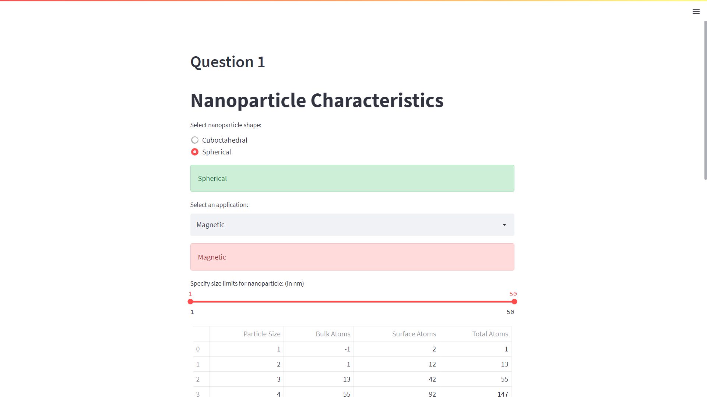
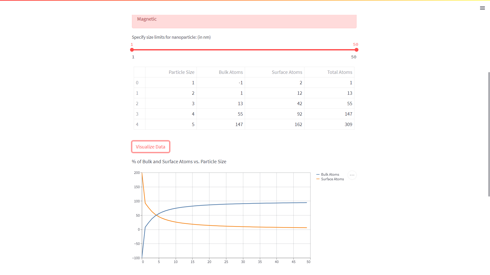
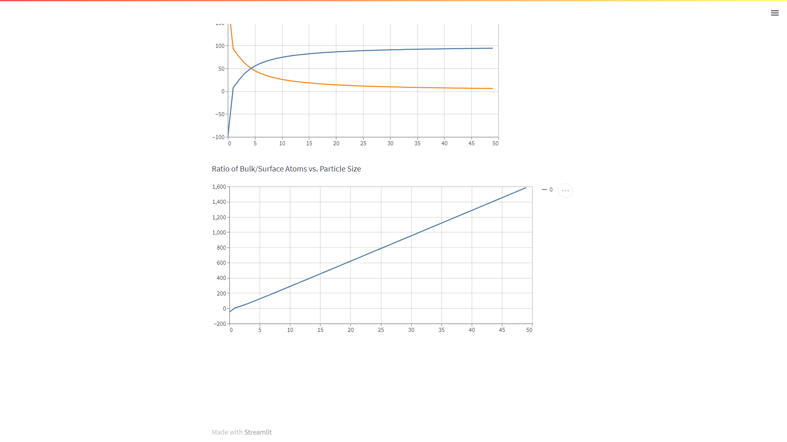

# PH401: Introduction to Nanomaterials

Rohit Ranjan (2001CS56)

[Click here](https://ph401-2001cs56.streamlit.app/) to visit deployed project

## Question 1

Q1. Write a computer program to deduce the total number of atoms and surface atoms for different shells of cuboctahedral/spherical shape. Plot % of atoms in bulk/surface versus particle size. The user should get ideas to generate the thickness or size of nanoparticles for a particular application (optical/electrical/magnetic/strength).

## How to run locally

Download the repository and move to that directory. Run the following commands:
```
pip install -r requirements.txt 
streamlit run index.py
```
Then visit the local url that shows in command prompt and voila!

## Implementation

### Inputs

* Shape (Cuboctahedral/Spherical)
* Application (Optical/Electrical/Magnetic/Strength/None)
* Range of size of nanoparticle (default: 1-50 nm): Depends on user choice of application

### Output

* Table with deduced values of bulk and surface atoms for each particular layer
* Graph that plots the surface atom % and bulk atom % w.r.t. particle sizes
* Graph that shows relation between bulk/surface atom ratio w.r.t. particle sizes

### Code

The code uses the following formulae:

```
1. Total Number of atoms in Cuboctahedral shape = (10k^3 + 15k^2 + 11k + 3)/3
2. Number of atoms on the surface of Cuboctahedral shape = (10k^2 + 2)
3. Total Number of atoms in Spherical shape = (10k^3 - 15k^2 + 11k - 3)/3
4. Number of atoms on the surface of Spherical shape = (10k^2 - 20k + 12)

where k is the size of nanoparticle here
```

After the user gives the inputs, the application will apply the appropriate formulae to calculate surface atoms, bulk atoms and total atoms. First 5 rows of the dataset are then displayed in a table for the viewer. 

Then we calculate the **% of surface atoms and bulk atoms** for the **specified shape** . These percentages are plotted **for all particle sizes in the size range specified**. Another graph for ratio between these atoms is also plotted. 

### Outputs





